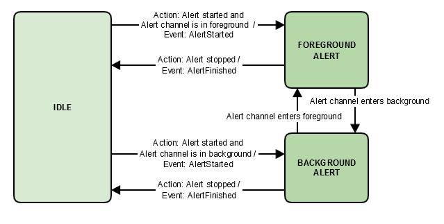

# Alert接口

Alert接口定义一系列指令和事件，用于设置、管理和取消timer、alarm和reminder。如遇网络中断或客户端与服务器时钟不同步时，您的客户端必须实现管理timer、alarm和reminder所需的必要逻辑。

## 1 状态图
下面的图表说明了由alert组件驱动的状态更改。框表示警报状态，连接器表示转换。

alert支持以下状态：

**IDLE**：在预先设定的alert开始之前，alert组件应该处于idle状态。alert一旦停止/结束，也应该返回到idle状态。这可能是用户语音、物理按键或GUI触发的结果。

**FOREGROUND ALERT**: 假设一个客户端的alert已经设置。当alert启动时，alert应该从idle状态转换到foreground状态，并且需要发送alertstarted事件到腾讯云小微。
只有当alert通道位于前台，dialog通道才处于非活跃状态。
当通过语音、按键、或GUI操作停止一个alert时，alert组件应该从foreground状态转换为idle状态。
alert响铃时，如果dialog通道被激活，alert组件应该从foreground状态转化为background状态。当dialog通道变成inactive时，alert应该返回到foreground状态，直到停止/完成。

**BACKGROUND ALERT**: 只有当dialog通道处于活动状态时，alert组件才转换到background状态。



## 2 Alerts上下文

腾讯云小微期望客户端上报每个本地存储的alert的状态，每个事件都需要上下文。alert被组织成两个列表：allAlerts和activeAlerts。allAlerts是本地存储的alert的完整列表。activeAlerts是当前用户选中的或正在响铃的alert列表。

**代码示例**
```java
{
    "header": {
        "namespace": "Alerts",
        "name": "AlertsState"
    },
    "payload": {
        "allAlerts": [
            {
                "token": "{{STRING}}",
                "type": "{{STRING}}",
                "scheduledTime": "{{STRING}}"
            }
        ],
        "activeAlerts": [
            {
                "token": "{{STRING}}",
                "type": "{{STRING}}",
                "scheduledTime": "{{STRING}}"
            }
        ]
    }
}
```

**有效负载参数**

| 参数                       | 描述                                           | 类型   |
| -------------------------- | ---------------------------------------------- | ------ |
| allAlerts                  | allAlerts的Key/value对                         | object |
| allAlerts.token            | 当设置alert时，腾讯云小微返回alert token。     | string |
| allAlerts.type             | 标识alert类型。接受值: TIMER, ALARM, REMINDER. | string |
| allAlerts.scheduledTime    | alert是按ISO 8601格式定义的。                  | string |
| activeAlerts               | activeAlerts的Key/value对。                    | object |
| activeAlerts.token         | 当前正在触发的alert的token。                   | string |
| activeAlerts.type          | 标识alert类型. 接受值: TIMER or ALARM          | string |
| activeAlerts.scheduledTime | alert的间间是按ISO 8601格式定义的。            | string |

## 3 SetAlert指令
此指令指示客户端在指定的时间周期或时间内设置timer、alarm或reminder。您的客户端可能会收到一个设置alert的语音请求触发的SetAlert指令。
如果在有效负载中未指定loopCount参数，则alert必须响一小时或直到用户停止(语音请求或物理按键)。
云端提供的资源优先于本地存储的音频文件。如果提供了云端资源，则必须按照assetPlayOrder列表中的顺序为用户播放。否则，使用腾讯提供的默认音频文件。

如果assets.url[i]不可访问，或者如果客户端未能下载相关文件，则它应该播放由腾讯提供的与alert类型对应的默认音频文件，并遵循所提供的loopCount和loopPauseInMilliSeconds设置。

**代码示例**
```java
{
    "directive": {
        "header": {
            "namespace": "Alerts",
            "name": "SetAlert",
            "messageId": "{{STRING}}",
            "dialogRequestId": "{{STRING}}"
        },
        "payload": {
            "token": "{{STRING}}",
            "type": "{{STRING}}",
            "scheduledTime": "{{STRING}}",
            "assets": [
                {
                    "assetId": "{{STRING}}",
                    "url": "{{STRING}}"
                },
                {
                    "assetId": "{{STRING}}",
                    "url": "{{STRING}}"
                },
            ],
            "assetPlayOrder": [ {{LIST}} ],
            "backgroundAlertAsset": "{{STRING}}",
            "loopCount": {{LONG}},
            "loopPauseInMilliSeconds": {{LONG}}
        }
    }
}
```

**Header参数**

| 参数            | 描述                                                         | 类型   |
| --------------- | ------------------------------------------------------------ | ------ |
| messageId       | 用于表示特定message的唯一ID。                                | string |
| dialogRequestId | 用于将response中的指令与特定的Recognize事件关联起来的唯一ID。 | string |

**有效负载参数**

| 参数                    | 描述                                                         | 类型   |
| ----------------------- | ------------------------------------------------------------ | ------ |
| token                   | 用于唯一标识一个alert的不透明的token值.                      | string |
| type                    | 标识alert类型. 如果一个未被识别的值被发送到客户端, 则取默认值ALARM. 接受值: TIMER, ALARM, REMINDER. | string |
| scheduledTime           | ISO 8601格式的alert的预定时间。                              | string |
| assets                  | 包含有要播放给用户的音频资源的列表。                         | list   |
| assets[i].assetId       | 音频资源的唯一ID。                                           | string |
| assets[i].url           | 标识云中资源的URL。此资源可由客户端下载并缓存。提供的URL在alert的scheduledTime后的60分钟内有效。 | string |
| assetPlayOrder          | 必须播放的音频资源的顺序。列表由assetIds组成。注：i） assetIds可能在列表中多次出现。这种情况下，所有的assetIds都必须被播放。ii）如果客户端无法下载和缓存资源，您的设备应该使用腾讯提供的默认音频文件。 | list   |
| backgroundAlertAsset    | 如果存在的话，backgroundAlertAsset值将与asset列表中的一个assetId匹配。如果backgroundAlertAsset不包含在有效负载中，默认为腾讯提供的腾讯云小微音频文件。 | string |
| loopCount               | 每个资源序列必须被播放的次数。例如：如果值为2，则客户端必须循环两次assetPlayOrder。注意：如果有效负载中没有loopCount，则必须循环播放资源一小时，或者直到用户停止alert。 | long   |
| loopPauseInMilliSeconds | 每个资源循环之间的暂停时间。例如：如果loopPauseInMilliSeconds是300，loopCount是3，则客户端必须在每个资源循环之间暂停300毫秒。 | long   |

## 4 SetAlertSucceeded事件

当客户端成功设置alert时，在接收到SetAlert指令之后，必须将SetAlertSucceeded事件发送到腾讯云小微。

**代码示例**
```java
{
    "event": {
        "header": {
            "namespace": "Alerts",
            "name": "SetAlertSucceeded",
            "messageId": "{{STRING}}"
        },
        "payload": {
            "token": "{{STRING}}"
        }
    }
}
```

**Header参数**

| 参数      | 描述                          | 类型   |
| --------- | ----------------------------- | ------ |
| messageId | 用于表示特定message的唯一ID。 | string |

**有效负载参数**

| 参数  | 描述                            | 类型   |
| ----- | ------------------------------- | ------ |
| token | SetAlert指令提供的不透明token。 | string |

## 5 SetAlertFailed事件

当客户端无法设置alert时，必须在接收到SetAlert指令后将该SetAlertFailed事件发送到腾讯云小微。

**代码示例**
```java
{
    "event": {
        "header": {
            "namespace": "Alerts",
            "name": "SetAlertFailed",
            "messageId": "{{STRING}}"
        },
        "payload": {
            "token": "{{STRING}}"
        }
    }
}
```

**Header参数**

| 参数      | 描述                          | 类型   |
| --------- | ----------------------------- | ------ |
| messageId | 用于表示特定message的唯一ID。 | string |

**有效负载参数**

| 参数  | 描述                            | 类型   |
| ----- | ------------------------------- | ------ |
| token | SetAlert指令提供的不透明token。 | string |

## 6 DeleteAlert指令

该指令从腾讯云小微发送，指示您的客户端删除现有alert。 当语音请求取消/删除timer，alarm或reminder时，客户端可能会收到DeleteAlert指令。

**示例代码**
```java
{
    "directive": {
        "header": {
            "namespace": "Alerts",
            "name": "DeleteAlert",
            "messageId": "{{STRING}}",
            "dialogRequestId": "{{STRING}}"
        },
        "payload": {
            "token": "{{STRING}}"
        }
    }
}
```
**Header参数**

| 参数            | 描述                                                  | 类型   |
| --------------- | ----------------------------------------------------- | ------ |
| messageId       | 用于表示特定message的唯一ID。                         | string |
| dialogRequestId | 用于关联为响应特定Recognize事件而发送的指令的唯一ID。 | string |

**有效载荷参数**

| 参数  | 描述                            | 类型   |
| ----- | ------------------------------- | ------ |
| token | 一个唯一标识警报的不透明token。 | string |

## 7 DeleteAlertSucceeded事件

当客户端成功删除或取消现有alert时，必须在收到DeleteAlert指令后将DeleteAlertSucceeded事件发送到腾讯云小微。

**注意**: 有关何时发送DeleteAlertSucceeded事件的更多信息，请参阅alert概述。

**示例代码**
```java
{
    "event": {
        "header": {
            "namespace": "Alerts",
            "name": "DeleteAlertSucceeded",
            "messageId": "{{STRING}}"
        },
        "payload": {
            "token": "{{STRING}}"
        }
    }
}
```

**Header参数**

| 参数      | 描述                          | 类型   |
| --------- | ----------------------------- | ------ |
| messageId | 用于表示特定message的唯一ID。 | string |

**有效载荷参数**

| 参数  | 描述                              | 类型   |
| ----- | --------------------------------- | ------ |
| token | DeleteAlert指令提供的不透明令牌。 | string |

## 8 DeleteAlertFailed事件

当客户端无法删除或取消现有alert时，必须在收到DeleteAlert指令后将DeleteAlertFailed事件发送到腾讯云小微。

**注意**: 有关何时发送DeleteAlertFailed事件的更多信息，请参阅alert概述。

**示例代码**
```java
{
    "event": {
        "header": {
            "namespace": "Alerts",
            "name": "DeleteAlertFailed",
            "messageId": "{{STRING}}"
        },
        "payload": {
            "token": "{{STRING}}"
        }
    }
}
```

**Header参数**

| 参数      | 描述                       | 类型   |
| --------- | -------------------------- | ------ |
| messageId | 用于表示特定消息的唯一ID。 | string |

**有效载荷参数**

| 参数  | 描述                              | 类型   |
| ----- | --------------------------------- | ------ |
| token | DeleteAlert指令提供的不透明令牌。 | string |

## 9 DeleteAlerts指令
该指令指示客户端删除产品上的所有现有alert。 每个alert由有效负载内的唯一令牌标识。 当语音请求取消/删除所有alert时，您的客户可能会收到DeleteAlerts指令。
如果无法删除一个或多个alert，则客户端必须回滚并向腾讯云小微发送DeleteAlertsFailed事件。 然后腾讯云小微将重试，直到删除所有alert，此时客户端必须发送DeleteAlertsSucceeded事件。

**注意**: 如果在客户端上找不到一个或多个alert的token，则客户端应继续删除所有匹配的token。 在这种情况下，此过程不会失败。 仅当无法删除产品上的一个或多个现有alert的token时，才应发送DeleteAlerts。

**示例代码**
```java
{
    "directive": {
        "header": {
            "namespace": "Alerts",
            "name": "AlertEnteredBackground",
            "messageId": "{{STRING}}"
        },
        "payload": {
            "tokens": ["{{STRING}}",...]
        }
    }
}
```

**Header参数**

| 参数            | 描述                                                  | 类型   |
| --------------- | ----------------------------------------------------- | ------ |
| messageId       | 用于表示特定消息的唯一ID。                            | string |
| dialogRequestId | 用于关联为响应特定Recognize事件而发送的指令的唯一ID。 | string |

**有效载荷参数**

| 参数   | 描述                                                    | 类型   |
| ------ | ------------------------------------------------------- | ------ |
| tokens | 一系列令牌。 每个标记都是一个唯一表示产品警报的字符串。 | string |

## 10 DeleteAlertsSucceeded事件

当客户端成功删除或取消令牌数组中的所有现有alert时，必须在收到DeleteAlerts指令后将DeleteAlertsSucceeded事件发送到腾讯云小微。

**注意**: 有关何时发送DeleteAlertsSucceeded事件的更多信息，请参阅alert概述。

**示例代码**
```java
{
    "event": {
        "header": {
            "namespace": "Alerts",
            "name": "AlertEnteredBackground",
            "messageId": "{{STRING}}"
        },
        "payload": {
            "tokens": ["{{STRING}}",...]
        }
    }
}
```
**Header参数**

| 参数      | 描述                       | 类型   |
| --------- | -------------------------- | ------ |
| messageId | 用于表示特定消息的唯一ID。 | string |

**有效负载参数**

| 参数   | 描述                                                      | 类型   |
| ------ | --------------------------------------------------------- | ------ |
| tokens | 一系列令牌。 每个标记都是一个唯一表示客户端警报的字符串。 | string |

## 11 DeleteAlertsFailed事件

当客户端无法删除或取消token数组中的至少一个现有alert时，必须在收到DeleteAlerts指令后将DeleteAlertsFailed事件发送到腾讯云小微。

**注意**: 有关何时发送DeleteAlertsFailed事件的更多信息，请参阅alert概述。

**示例代码**
```java
{
    "event": {
        "header": {
            "namespace": "Alerts",
            "name": "AlertEnteredBackground",
            "messageId": "{{STRING}}"
        },
        "payload": {
            "tokens": ["{{STRING}}",...]
        }
    }
}
```

**Header参数**

| 参数      | 描述                       | 类型   |
| --------- | -------------------------- | ------ |
| messageId | 用于表示特定消息的唯一ID。 | string |

**有效负载参数**

| 参数   | 描述                                                    | 类型   |
| ------ | ------------------------------------------------------- | ------ |
| tokens | 一系列令牌。 每个标记都是一个唯一表示产品警报的字符串。 | string |

## 12 AlertStarted事件
当在其预定时间触发alert时，必须将AlertStarted事件发送到腾讯云小微。

**示例代码**
```java
{
    "event": {
        "header": {
            "namespace": "Alerts",
            "name": "AlertStarted",
            "messageId": "{{STRING}}"
        },
        "payload": {
            "token": "{{STRING}}"
        }
    }
}
```
**Header参数**

| 参数      | 描述                       | 类型   |
| --------- | -------------------------- | ------ |
| messageId | 用于表示特定消息的唯一ID。 | string |

**有效负载参数**

| 参数  | 描述                           | 类型   |
| ----- | ------------------------------ | ------ |
| token | SetAlert指令提供的不透明令牌。 | string |

## 13 AlertStopped事件

当活动警报停止时，必须将AlertStopped事件发送到腾讯云小微。 在以下情况下停止警报：
1. 收到DeleteAlert指令。 发送AlertStopped事件后，如果使用DeleteAlertSucceeded事件或DeleteAlertFailed事件成功删除警报，则客户端必须通知腾讯云小微。 “alert概述”中说明了此交互。
2. 物理控件（硬件按钮或GUI）用于停止警报。
3. loopCount已完成，或者没有loopCount的警报已播放一小时并在本地停止。

**示例代码**
```java
{
    "event": {
        "header": {
            "namespace": "Alerts",
            "name": "AlertStopped",
            "messageId": "{STRING}"
        },
        "payload": {
            "token": "{{STRING}}"
        }
    }
}
```

**Header参数**

| 参数      | 描述                       | 类型   |
| --------- | -------------------------- | ------ |
| messageId | 用于表示特定消息的唯一ID。 | string |

**有效负载参数**

| 参数  | 描述                           | 类型   |
| ----- | ------------------------------ | ------ |
| token | SetAlert指令提供的不透明令牌。 | string |

## 14 AlertEnteredForeground事件

当活动警报进入前台（以全音量播放）或在对话通道上的并发交互完成后重新进入前台时，必须将AlertEnteredForeground事件从您的客户端发送到腾讯云小微。

**示例代码**
```java
{
    "event": {
        "header": {
            "namespace": "Alerts",
            "name": "AlertEnteredForeground",
            "messageId": "{{STRING}}"
        },
        "payload": {
            "token": "{{STRING}}"
        }
    }
}
```

**Header参数**

| 参数      | 描述                       | 类型   |
| --------- | -------------------------- | ------ |
| messageId | 用于表示特定消息的唯一ID。 | string |

**有效负载参数**

| 参数  | 描述                           | 类型   |
| ----- | ------------------------------ | ------ |
| token | SetAlert指令提供的不透明令牌。 | string |

## 15 AlertEnteredBackground事件

当活跃的alert退出前台（衰减或暂停）时，例如在Dialog通道上发生的并发交互，必须从客户端向腾讯云小微发送AlertEnteredBackground事件。

**示例代码**
```java
{
    "event": {
        "header": {
            "namespace": "Alerts",
            "name": "AlertEnteredBackground",
            "messageId": "{{STRING}}"
        },
        "payload": {
            "token": "{{STRING}}"
        }
    }
}
```

**Header参数**

| 参数      | 描述                       | 类型   |
| --------- | -------------------------- | ------ |
| messageId | 用于表示特定消息的唯一ID。 | string |


**有效负载参数**

| 参数  | 描述                             | 类型   |
| ----- | -------------------------------- | ------ |
| token | SetAlert指令中提供的不透明令牌。 | string |

## 16 SetVolume指令

该指令指示客户端设置alert的绝对音量级别。

**示例代码**
```java
{
    "directive": {
        "header": {
            "namespace": "Alerts",
            "name": "SetVolume",
            "messageId": "{{STRING}}",
            "dialogRequestId": {{STRING}}
        },
        "payload": {
            "volume": "{{LONG}}"
        }
    }
}
```

**Header参数**

| 参数            | 描述                                                  | 类型   |
| --------------- | ----------------------------------------------------- | ------ |
| messageId       | 用于表示特定消息的唯一ID。                            | string |
| dialogRequestId | 用于关联为响应特定Recognize事件而发送的指令的唯一ID。 | string |

**有效负载参数**

| 参数   | 描述                                                         | 类型 |
| ------ | ------------------------------------------------------------ | ---- |
| volume | 绝对音量范围从0（最小）到100（最大）。 可接受的值：0到100之间的任何值，包括0和100。 | long |

## 17 AdjustVolume指令

该指令指示客户端调整alert的相对音量级别。

**示例代码**
```java
{
    "directive": {
        "header": {
            "namespace": "Alerts",
            "name": "AdjustVolume",
            "messageId": "{{STRING}}",
            "dialogRequestId": {{STRING}}
        },
        "payload": {
            "volume": "{{LONG}}"
        }
    }
}
```

**Header参数**

| 参数            | 描述                                                  | 类型   |
| --------------- | ----------------------------------------------------- | ------ |
| messageId       | 用于表示特定消息的唯一ID。                            | string |
| dialogRequestId | 用于关联为响应特定Recognize事件而发送的指令的唯一ID。 | string |

**有效负载参数**

| 参数   | 描述                                                         | 类型 |
| ------ | ------------------------------------------------------------ | ---- |
| volume | 相对音量调整。正或负long类型值，用于相对于当前音量设置增加或减少音量。 可接受的值：介于-100和100之间的任何值。 | long |

## 18 VolumeChanged事件

收到SetVolume或AdjustVolume指令后，必须将此事件发送到腾讯云小微。

**示例代码**
```java
{
    "event": {
        "header": {
            "namespace": "Alerts",
            "name": "VolumeChanged",
            "messageId": "{{STRING}}"
        },
        "payload": {
            "volume": "{{LONG}}"
        }
    }
}
```

**Header参数**

| 参数      | 描述                       | 类型   |
| --------- | -------------------------- | ------ |
| messageId | 用于表示特定消息的唯一ID。 | string |


**有效负载参数**

|参数|描述|类型|
| --------    | -----      |  -----     |
|volume|这是您的产品在本地调整的音量。 可接受的值：音量必须是0（最小）和100（最大）之间的值，包括0和100。
**重要提示**：如果您的产品本地支持从0到10的音量调整，则必须将其缩放到0到100的范围。例如，当用户将音量增加到8时，腾讯云小微预期发送的音量值为80。|long|