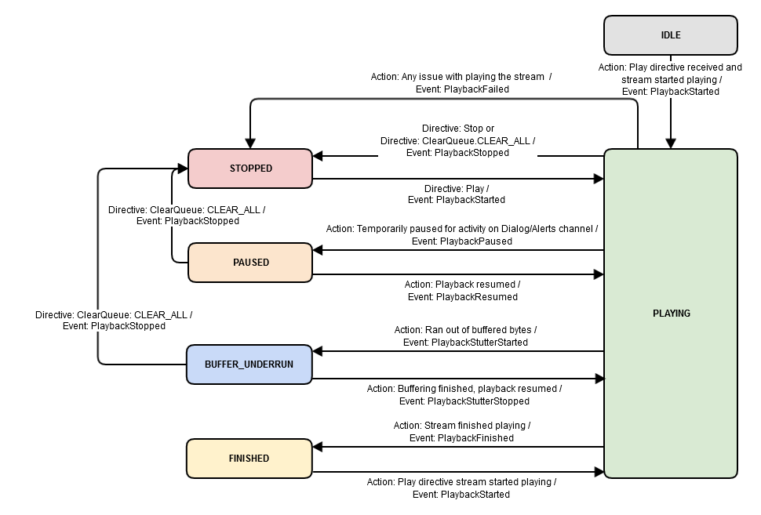

# AudioPlayer接口

AudioPlayer接口提供了通过语音控制音频播放的指令，以及用于管理和监控播放进度的事件。 如果您要将播放控件映射到按钮（物理或GUI），请参考PlaybackController接口。

## 1 状态图
下图说明了由AudioPlayer组件驱动的状态更改。 框表示AudioPlayer状态，连接器表示状态转换。
AudioPlayer具有以下状态：

**IDLE**: 当产品最初启动或重新启动时以及在执行Play指令之前，AudioPlayer仅处于idle状态。

**PLAYING**: 当您的客户端启动音频流播放时，AudioPlayer必须从idle状态转换为playing。
如果您收到指示客户端执行操作的指令，例如暂停或停止音频流，如果客户端无法缓冲流，或者如果播放失败，则AudioPlayer必须在执行操作时转换到适当的状态（并且向腾讯云小微发送事件）。 否则，AudioPlayer必须保持播放状态，直到当前流完成。
此外，在以下情况下，AudioPlayer必须保持播放状态：

- 向腾讯云小微报告播放进度
- 将流元数据发送到腾讯云小微

**STOPPED**: 有四种情况，AudioPlayer必须转换到stopped状态。 在playing状态下，AudioPlayer必须在以下情况下转换为stopped：
- 遇到流问题，播放失败
- 客户端从腾讯云小微收到Stop指令
- 收到ClearQueue指令，其clearBehavior为CLEAR_ALL
- 接收到playBehavior为REPLACE_ALL的Play指令
  在暂停或buffer_underrun状态下，当接收到ClearQueuedirective到CLEAR_ALL时，AudioPlayer必须转换为stopped。
  每当您的客户端收到Play指令，开始播放音频流并向腾讯云小微发送PlaybackStarted事件时，AudioPlayer必须从stopped转换为playing。

**PAUSED**: 当内容频道上的音频暂停以容纳更高优先级的输入/输出（例如用户或腾讯云小微语音）时，AudioPlayer必须转换到paused状态。 优先活动完成后，必须恢复播放。 有关确定音频输入/输出优先级的更多信息，请参阅交互模型。

**BUFFER_UNDERRUN**: 当客户端的数据输入速度低于读取数据时，AudioPlayer必须转换到buffer_underrun状态。 AudioPlayer必须保持此状态，直到缓冲区足够恢复播放，此时它必须返回playing状态。

**FINISHED**: 当流完成播放时，AudioPlayer必须转换到finished状态。 对于播放队列中的每个流都是如此。即使有排队播放的流，您的客户端也需要向腾讯云小微发送PlaybackFinished事件，然后在每个流播放完毕后从playing状态转换为finished状态。

在以下情况下，AudioPlayer必须从finished转换到playing：
- 客户端收到Play指令
- 播放队列中的下一个流开始播放（播放PlaybackStarted事件之后）



## 2 上下文

腾讯云小微希望客户端报告playerActivity（状态），以及当前正在播放的媒体项的offsetInMilliseconds以及需要上下文的每个事件。

**示例代码**

```java
{
    "header": {
        "namespace": "AudioPlayer",
        "name": "PlaybackState"
    },
    "payload": {
        "token": "{{STRING}}",
        "offsetInMilliseconds": {{LONG}},
        "playerActivity": "{{STRING}}"
    }
}
```

**有效负载参数**

| 参数                 | 描述                                                         | 类型   |
| -------------------- | ------------------------------------------------------------ | ------ |
| token                | 这必须与当前播放的媒体项的标记匹配。 否则，令牌必须与收到的最后一个Play指令中提供的令牌相匹配。 | string |
| offsetInMilliseconds | 标识轨道的当前偏移（以毫秒为单位）。 发送的值必须等于或大于零。 不接受负值。 | long   |
| playerActivity       | 标识AudioPlayer的组件状态。 接受的值: IDLE, PLAYING, STOPPED, PAUSED, BUFFER_UNDERRUN, and FINISHED. | string |

| 播放器状态      | 描述                                 |
| --------------- | ------------------------------------ |
| IDLE            | 未播放任何内容，也有在队列中的内容。 |
| PLAYING         | 流正在播放。                         |
| PAUSED          | 流被暂停了。                         |
| BUFFER_UNDERRUN | 缓冲区不足。                         |
| FINISHED        | 流播放结束。                         |
| STOPPED         | 流被打断了。                         |

## 3 Play指令
Play指令将发送到您的客户端以启动音频播放。 它是一个由JSON指令组成的多部分消息，最多包含一个音频流或二进制音频附件。

**注意**: 了解有关二进制音频附件的更多信息。
指令的有效负载中包含的playBehavior参数可用于确定客户端必须如何处理流的排队和回放。接受的值提供了必须采取的操作的提示：
- **REPLACE_ALL**: 立即开始播放使用Play指令返回的流，并替换当前和排队的流。 播放流时，如果您收到PlayBehavior为REPLACE_ALL的Play指令，则必须向腾讯云小微发送PlaybackStopped事件。
- **ENQUEUE**: 将流添加到当前队列的末尾。
- **REPLACE_ENQUEUED**: 替换队列中的所有流。 这不会影响当前播放的流。

**注意**: 将流添加到回放队列时，必须确保当前播放的流的标记与要添加到队列的流中的expectedPreviousToken匹配。 如果令牌不匹配，则必须忽略该流。 但是，如果未返回expectedPreviousToken，则必须将流添加到队列中。

**示例代码**
```java
{
    "directive": {
        "header": {
            "namespace": "AudioPlayer",
            "name": "Play",
            "messageId": "{{STRING}}",
            "dialogRequestId": "{{STRING}}"
        },
        "payload": {
            "playBehavior": "{{STRING}}",
            "audioItem": {
                "audioItemId": "{{STRING}}",
                "stream": {
                        "url": "{{STRING}}",
                        "streamFormat": "AUDIO_MPEG"
                        "offsetInMilliseconds": {{LONG}},
                        "expiryTime": "{{STRING}}",
                        "progressReport": {
                            "progressReportDelayInMilliseconds": {{LONG}},
                            "progressReportIntervalInMilliseconds": {{LONG}}
                        },
                        "token": "{{STRING}}",
                        "expectedPreviousToken": "{{STRING}}"
                }
            }
        }
    }
}
```

**二进制音频附件**

Play指令可以具有相应的二进制音频附件作为多部分消息的一部分。 当存在二进制音频附件时，为url提供的值将包括以下前缀：cid。
以下多部分标题将位于二进制音频附件之前：
```java
Content-Type: application/octet-stream
Content-ID: {{Audio Item CID}}

{{BINARY AUDIO ATTACHMENT}}
```

**Header参数**

| 参数            | 描述                                                  | 类型   |
| --------------- | ----------------------------------------------------- | ------ |
| messageId       | 用于表示特定消息的唯一ID。                            | string |
| dialogRequestId | 用于关联为响应特定Recognize事件而发送的指令的唯一ID。 | string |

**有效负载参数**

 **重要**: 您的客户端必须设计为适应并支持Play支持的所有有效负载参数，并且如果缺少JSON中的键/值对，则不得中断。

| 参数                                                         | 描述                                                         | 类型   |
| ------------------------------------------------------------ | ------------------------------------------------------------ | ------ |
| playBehavior                                                 | 提供播放提示。 可接受的值：REPLACE_ALL，ENQUEUE和REPLACE_ENQUEUED。 **REPLACE_ALL**：立即开始播放使用Play指令返回的流，并替换当前和排队的流。**ENQUEUE**：将流添加到当前队列的末尾。**REPLACE_ENQUEUED*：全部替换队列中的流。这不会影响当前播放的流。 | string |
| audioItem                                                    | 包含audioItems的键/值对。                                    | object |
| audioItem.audioItemId                                        | 标识audioItem。                                              | string |
| audioItem.stream                                             | 包含流的键/值对。                                            | object |
| audioItem.stream.url                                         | 标识音频内容的位置。 如果音频内容是二进制音频附件，则该值将是内容的唯一标识符，格式如下：“cid：”。 否则，该值将是远程http/https位置。 | string |
| audioItem.stream.streamFormat                                | 当Playdirective具有关联的二进制音频附件时，streamFormat包含在有效负载中。 如果关联的音频是流，则不会出现此参数。 接受值: AUDIO_MPEG | string |
| audioItem.stream.offsetInMilliseconds                        | 一个时间戳，指示客户端必须在流中的哪个位置开始播放。 例如，当offsetInMilliseconds设置为0时，这表示流的回放必须从0开始，或者从流的开始。 任何其他值表示播放必须从提供的偏移量开始。 | long   |
| audioItem.stream.expiryTime                                  | 流的过期时间，以ISO 8601格式定义。                           | string |
| audioItem.stream.progressReport                              | 包含进度报告的键/值对。                                      | object |
| audioItem.stream.progressReport. progressReportDelayInMilliseconds | 指定（以毫秒为单位）何时将ProgressReportDelayElapsed事件发送到腾讯云小微。 ProgressReportDelayElapsed只能以指定的间隔发送一次。 请注意：某些音乐提供商不需要此报告。 如果不需要报告，则progressReportDelayInMilliseconds不会出现在有效负载中。 | long   |
| audioItem.stream.progressReport. progressReportIntervalInMilliseconds | 指定何时（以毫秒为单位）向腾讯云小微发出ProgressReportIntervalElapsed事件。 必须以指定的时间间隔定期发送ProgressReportIntervalElapsed。 请注意：某些音乐提供商不需要此报告。 如果不需要报告，则progressReportIntervalInMilliseconds不会出现在有效负载中。 | long   |
| audioItem.stream.token                                       | 表示当前流的不透明令牌。                                     | string |
| audioItem.stream.expectedPreviousToken                       | 一个不透明的标记，表示预期的上一个流。                       | string |

## 4 PlaybackStarted事件

在客户端处理Play指令并开始播放相关音频流后，必须将**PlaybackStarted**事件发送到腾讯云小微。

**注意**: 对于腾讯云小微发送的每个URL，它预期不会有多个PlaybackStarted事件。 如果您收到播放列表网址（由多个网址组成），则只发送一个PlaybackStarted事件。

**示例代码**
```java
{
    "event": {
        "header": {
            "namespace": "AudioPlayer",
            "name": "PlaybackStarted",
            "messageId": "{{STRING}}"
        },
        "payload": {
            "token": "{{STRING}}",
            "offsetInMilliseconds": {{LONG}}
        }
    }
}
```

**Header参数**

| 参数      | 描述                       | 类型   |
| --------- | -------------------------- | ------ |
| messageId | 用于表示特定消息的唯一ID。 | string |


**有效负载参数**

| 参数                 | 描述                                                         | 类型   |
| -------------------- | ------------------------------------------------------------ | ------ |
| token                | Play指令提供的不透明令牌。                                   | string |
| offsetInMilliseconds | 标识轨道的当前偏移（以毫秒为单位）。发送的值必须等于或大于零。 不接受负值。 | long   |

## 5 PlaybackNearlyFinished事件

当您的客户端准备缓冲/下载回放队列中的下一个流时，必须发送PlaybackNearlyFinished事件。 您的客户端必须确保仅在当前播放的流的PlaybackStarted事件之后发送此事件。 腾讯云小微将通过以下方式之一回应此事件：
- 包含下一个流的Play指令
- HTTP 204响应代码

**提示**: 作为最佳实践，您可能需要考虑等待上一首歌曲被缓冲，然后再向腾讯云小微发送PlaybackNearlyFinished事件。 这降低了超过expiryTime的风险，并且可以降低在同时下载和处理多个Play指令时可能发生的回放断断续续的频率。

**示例代码**
```java
{
    "event": {
        "header": {
            "namespace": "AudioPlayer",
            "name": "PlaybackNearlyFinished",
            "messageId": "{{STRING}}"
        },
        "payload": {
            "token": "{{STRING}}",
            "offsetInMilliseconds": {{LONG}}
        }
    }
}
```

**Header参数**

| 参数      | 描述                       | 类型   |
| --------- | -------------------------- | ------ |
| messageId | 用于表示特定消息的唯一ID。 | string |


**有效负载参数**

| 参数                 | 描述                                                         | 类型   |
| -------------------- | ------------------------------------------------------------ | ------ |
| token                | Play指令提供的不透明令牌。                                   | string |
| offsetInMilliseconds | 标识轨道的当前偏移（以毫秒为单位）。 发送的值必须等于或大于零。 不接受负值。 | long   |

## 6 ProgressReportDelayElapsed事件

如果Play指令中存在progressReportDelayInMilliseconds，则必须将ProgressReportDelayElapsed事件发送到腾讯云小微。 事件必须从流的开始以指定的间隔发送一次（而不是从offsetInMilliseconds）。 例如，如果Play指令包含值为20000的progressReportDelayInMilliseconds，则必须从轨道起点开始20,000毫秒发送ProgressReportDelayElapsed事件。 但是，如果Play指令包含offsetInMilliseconds值10000和progressReportDelayInMilliseconds值20000，则必须将该事件发送到播放10,000毫秒。 这是因为进度报告是从流的开头发送的，而不是Play指令的偏移量。

**示例代码**
```java
{
    "event": {
        "header": {
            "namespace": "AudioPlayer",
            "name": "ProgressReportDelayElapsed",
            "messageId": "{{STRING}}"
        },
        "payload": {
            "token": "{{STRING}}",
            "offsetInMilliseconds": {{LONG}}
        }
    }
}
```

**Header参数**

| 参数      | 描述                       | 类型   |
| --------- | -------------------------- | ------ |
| messageId | 用于表示特定消息的唯一ID。 | string |


**有效负载参数**

| 参数                 | 描述                                                         | 类型   |
| -------------------- | ------------------------------------------------------------ | ------ |
| token                | Play指令提供的不透明令牌。                                   | string |
| offsetInMilliseconds | 标识轨道的当前偏移（以毫秒为单位）。 发送的值必须等于或大于零。 不接受负值。 | long   |

## 7 ProgressReportIntervalElapsed事件

如果Play指令中存在progressReportIntervalInMilliseconds，则必须将ProgressReportIntervalElapsed事件发送到腾讯云小微。 必须从流的开始（而不是offsetInMilliseconds）以指定的间隔定期发送事件。 例如，如果Play指令包含值为20000的progressReportIntervalInMilliseconds，则必须在轨道开始后20,000毫秒发送ProgressReportIntervalElapsed事件，并且每隔20,000毫秒发送一次，直到流结束。 但是，如果Play指令包含offsetInMilliseconds值为10000且progressReportIntervalInMilliseconds值为20000，则必须在播放开始后10,000毫秒发送事件，之后每隔20,000毫秒发送一次，直到流结束。 这是因为指定的间隔来自流的开头，而不是Play指令的偏移量。

**示例代码**
```java
{
    "event": {
        "header": {
            "namespace": "AudioPlayer",
            "name": "ProgressReportIntervalElapsed",
            "messageId": "{{STRING}}"
        },
        "payload": {
            "token": "{{STRING}}",
            "offsetInMilliseconds": {{LONG}}
        }
    }
}
```

**Header参数**

| 参数      | 描述                       | 类型   |
| --------- | -------------------------- | ------ |
| messageId | 用于表示特定消息的唯一ID。 | string |


**有效负载参数**

| 参数                 | 描述                                                         | 类型   |
| -------------------- | ------------------------------------------------------------ | ------ |
| token                | Play指令提供的不透明令牌。                                   | string |
| offsetInMilliseconds | 标识轨道的当前偏移（以毫秒为单位）。 发送的值必须等于或大于零。 不接受负值。 | long   |

## 8 PlaybackStutterStarted事件

PlaybackStutterStarted事件必须在PlaybackStarted事件之后发送到腾讯云小微，此时客户端的AudioPlayer组件的数据输入速度比读取时慢。 一旦发送此事件，组件必须转换到buffer_underrun状态，并保持此状态，直到缓冲区足够恢复播放。

**示例代码**
```java
{
    "event": {
        "header": {
            "namespace": "AudioPlayer",
            "name": "PlaybackStutterStarted",
            "messageId": "{{STRING}}"
        },
        "payload": {
            "token": "{{STRING}}",
            "offsetInMilliseconds": {{LONG}}
        }
    }
}
```

**Header参数**

| 参数      | 描述                       | 类型   |
| --------- | -------------------------- | ------ |
| messageId | 用于表示特定消息的唯一ID。 | string |


**有效负载参数**

| 参数                 | 描述                                                         | 类型   |
| -------------------- | ------------------------------------------------------------ | ------ |
| token                | Play指令提供的不透明令牌。                                   | string |
| offsetInMilliseconds | 标识轨道的当前偏移（以毫秒为单位）。 发送的值必须等于或大于零。 不接受负值。 | long   |

## 9 PlaybackStutterFinished事件

当缓冲区足够满足以恢复流的回放时，必须将PlaybackStutterFinished事件发送到腾讯云小微。 当音频播放恢复时，腾讯云小微不期望后续的PlaybackStarted事件。

**示例代码**
```java
{
    "event": {
        "header": {
            "namespace": "AudioPlayer",
            "name": "PlaybackStutterFinished",
            "messageId": "{{STRING}}"
        },
        "payload": {
            "token": "{{STRING}}",
            "offsetInMilliseconds": {{LONG}},
            "stutterDurationInMilliseconds": {{LONG}}
        }
    }
}
```

**Header参数**

| 参数      | 描述                       | 类型   |
| --------- | -------------------------- | ------ |
| messageId | 用于表示特定消息的唯一ID。 | string |


**有效负载参数**

| 参数                          | 描述                                                         | 类型   |
| ----------------------------- | ------------------------------------------------------------ | ------ |
| token                         | Play指令提供的不透明令牌。                                   | string |
| offsetInMilliseconds          | 标识轨道的当前偏移（以毫秒为单位）。 发送的值必须等于或大于零。 不接受负值。 | long   |
| stutterDurationInMilliseconds | 标识播放不连贯的持续时间（以毫秒为单位）。                   | long   |

## 10 PlaybackFinished事件

当您的客户端完成流的播放时，必须将PlaybackFinished事件发送到腾讯云小微。
在以下情况下不会发送此事件：
- 停止播放（本地按键或Stop指令的结果）
- 在流之间切换换（下一个/上一个）

**注意**：对于腾讯云小微发送的每个URL，它预期收到不超过一个PlaybackFinished事件。 如果您收到播放列表网址（由多个网址组成），则只发送一个PlaybackFinished事件。

**示例代码**
```java
{
    "event": {
        "header": {
            "namespace": "AudioPlayer",
            "name": "PlaybackFinished",
            "messageId": "{{STRING}}"
        },
        "payload": {
            "token": "{{STRING}}",
            "offsetInMilliseconds": {{LONG}}
        }
    }
}
```

**Header参数**

| 参数      | 描述                       | 类型   |
| --------- | -------------------------- | ------ |
| messageId | 用于表示特定消息的唯一ID。 | string |


**有效负载参数**

| 参数                 | 描述                                                         | 类型   |
| -------------------- | ------------------------------------------------------------ | ------ |
| token                | Play指令提供的不透明令牌。                                   | string |
| offsetInMilliseconds | 标识轨道的当前偏移（以毫秒为单位）。 发送的值必须等于或大于零。 不接受负值。 | long   |

## 11 PlaybackFailed事件

每当您的客户端在尝试播放流时遇到错误，都必须将PlaybackFailed事件发送到腾讯云小微。 在流正在播放且下一个流无法缓冲的情况下，currentPlaybackToken可能与有效负载中的令牌不同。

**示例代码**
```java
{
    "event": {
        "header": {
            "namespace": "AudioPlayer",
            "name": "PlaybackFailed",
            "messageId": "{{STRING}}"
        },
        "payload": {
            "token": "{{STRING}}",
            "currentPlaybackState": {
                "token": "{{STRING}}",
                "offsetInMilliseconds": {{LONG}},
                "playerActivity": "{{STRING}}"
            },
            "error": {
                "type": "{{STRING}}",
                "message": "{{STRING}}"
            }
        }
    }
}
```

**Header参数**

| 参数      | 描述                       | 类型   |
| --------- | -------------------------- | ------ |
| messageId | 用于表示特定消息的唯一ID。 | string |

**有效负载参数**

| 参数                               | 描述                                                         | 类型   |
| ---------------------------------- | ------------------------------------------------------------ | ------ |
| token                              | Play指令提供的不透明令牌，表示无法播放的流。                 | string |
| currentPlaybackState               | 包含playbackState对象的键/值对。                             | object |
| playbackState.token                | Play指令提供的不透明令牌。                                   | string |
| playbackState.offsetInMilliseconds | 标识轨道的当前偏移（以毫秒为单位）。 发送的值必须等于或大于零。 不接受负值。 | long   |
| playbackState.playerActivity       | 标识播放器状态。 可接受的值： PLAYING, STOPPED, PAUSED, FINISHED, BUFFER_UNDERRUN, or IDLE. | string |
| error                              | 包含错误消息的键/值对。                                      | object |
| error.type                         | 标识特定类型的错误。 下表提供了每种错误类型的详细信息。      | string |
| error.message                      | 设备遇到的错误的描述。这仅用于记录目的。对于HTTP相关错误，错误消息应包含HTTP错误响应正文（如果存在）。 | string |

**错误类型**

| 取值                              | 描述                                                         |
| --------------------------------- | ------------------------------------------------------------ |
| MEDIA_ERROR_UNKNOWN               | 出现未知错误。                                               |
| MEDIA_ERROR_INVALID_REQUEST       | 服务器将请求识别为格式错误。 例如。 错误请求，未经授权，禁止，未找到等 |
| MEDIA_ERROR_SERVICE_UNAVAILABLE   | 客户端无法访问该服务。                                       |
| MEDIA_ERROR_INTERNAL_SERVER_ERROR | 服务器接受了请求，但无法按预期处理请求。                     |
| MEDIA_ERROR_INTERNAL_DEVICE_ERROR | 客户端出现内部错误。                                         |

## 12 Stop指令

Stop指令将发送到您的客户端以停止播放音频流。 您的客户可能会因语音请求，物理按键按下或GUI启动而收到Stop指令。

**示例代码**
```java
{
    "directive": {
        "header": {
            "namespace": "AudioPlayer",
            "name": "Stop",
            "messageId": "{{STRING}}",
            "dialogRequestId": "{{STRING}}"
        },
        "payload": {
        }
    }
}
```

**Header参数**

| 参数            | 描述                                                  | 类型   |
| --------------- | ----------------------------------------------------- | ------ |
| messageId       | 用于表示特定消息的唯一ID。                            | string |
| dialogRequestId | 用于关联为响应特定Recognize事件而发送的指令的唯一ID。 | string |

## 13 PlaybackStopped事件

当您的客户端收到以下指令之一并停止播放音频流时，必须将PlaybackStopped事件发送到腾讯云小微：
- Stop指令
- Play指令，其playBehavior为REPLACE_ALL
- ClearQueue指令，其clearBehavior为CLEAR_ALL

**注意**: 仅当由于接收到上面列出的指令之一而终止流时才会发送此事件。 通常，这是用户操作的结果。 当流完成播放时，不得发送此事件（请参阅PlaybackFinished）。

**示例代码**
```java
{
    "event": {
        "header": {
            "namespace": "AudioPlayer",
            "name": "PlaybackStopped",
            "messageId": "{{STRING}}"
        },
        "payload": {
            "token": "{{STRING}}",
            "offsetInMilliseconds": {{LONG}}
        }
    }
}
```

**Header参数**

| 参数      | 描述                       | 类型   |
| --------- | -------------------------- | ------ |
| messageId | 用于表示特定消息的唯一ID。 | string |

**有效负载参数**

| 参数                 | 描述                                                         | 类型   |
| -------------------- | ------------------------------------------------------------ | ------ |
| token                | Play指令提供的不透明令牌。                                   | string |
| offsetInMilliseconds | 标识轨道的当前偏移（以毫秒为单位）。 发送的值必须等于或大于零。 不接受负值。 | long   |

## 14 PlaybackPaused事件

当您的客户端暂时暂停内容频道上的音频以适应更高优先级的输入/输出时，必须发送PlaybackPaused事件。 当优先活动完成时，必须恢复播放; 此时您的客户端必须发送PlaybackResumed事件。 有关确定音频输入/输出优先级的更多信息，请参阅交互模型。

**注意**: 应该在Recognize事件之后发送PlaybackPaused以减少延迟。

**示例代码**
```java
{
    "event": {
        "header": {
            "namespace": "AudioPlayer",
            "name": "PlaybackPaused",
            "messageId": "{{STRING}}"
        },
        "payload": {
            "token": "{{STRING}}",
            "offsetInMilliseconds": {{LONG}}
        }
    }
}
```

**Header参数**

| 参数      | 描述                       | 类型   |
| --------- | -------------------------- | ------ |
| messageId | 用于表示特定消息的唯一ID。 | string |


**有效负载参数**

| 参数                 | 描述                                                         | 类型   |
| -------------------- | ------------------------------------------------------------ | ------ |
| token                | Play指令中提供的不透明令牌。                                 | string |
| offsetInMilliseconds | 标识轨道的当前偏移（以毫秒为单位）。 发送的值必须等于或大于零。 不接受负值。 | long   |

## 15 PlaybackResumed事件

播放在PlaybackPaused事件之后恢复时（当在内容频道暂时暂停播放以容纳更高优先级的输入/输出时），必须将PlaybackResumed事件发送到腾讯云小微。 有关确定音频输入/输出优先级的更多信息，请参阅交互模型。

**示例代码**
```java
{
    "event": {
        "header": {
            "namespace": "AudioPlayer",
            "name": "PlaybackResumed",
            "messageId": "{{STRING}}"
        },
        "payload": {
            "token": "{{STRING}}",
            "offsetInMilliseconds": {{LONG}}
        }
    }
}
```

**Header参数**

| 参数      | 描述                       | 类型   |
| --------- | -------------------------- | ------ |
| messageId | 用于表示特定消息的唯一ID。 | string |


**有效负载参数**

| 参数                 | 描述                                                         | 类型   |
| -------------------- | ------------------------------------------------------------ | ------ |
| token                | Play指令中提供的不透明令牌。                                 | string |
| offsetInMilliseconds | 标识轨道的当前偏移（以毫秒为单位）。 发送的值必须等于或大于零。 不接受负值。 | long   |

## 16 ClearQueue指令

ClearQueue指令从腾讯云小微发送到您的客户端以清除回放队列。 ClearQueuedirective有两个行为：CLEAR_ENQUEUED，它清除队列并继续播放当前播放的流; 和CLEAR_ALL，它清除整个回放队列并停止当前播放的流（如果适用的话）。

**示例代码**
```java
{
    "directive": {
        "header": {
            "namespace": "AudioPlayer",
            "name": "ClearQueue",
            "messageId": "{{STRING}}",
            "dialogRequestId": "{{STRING}}"
        },
        "payload": {
            "clearBehavior": "{{STRING}}"
        }
    }
}
```

**Header参数**

|参数|描述|类型|
| --------    | -----      |  -----     |
|messageId|用于表示特定消息的唯一ID。|string
|dialogRequestId|用于关联为响应特定Recognize事件而发送的指令的唯一ID。|string|

**有效负载参数**

| 参数          | 描述                                                         | 类型   |
| ------------- | ------------------------------------------------------------ | ------ |
| clearBehavior | 用于确定清除队列行为的字符串值。 可接受的值：CLEAR_ENQUEUED和CLEAR_ALL | string |

## 17 PlaybackQueueCleared事件

在客户端处理ClearQueue指令后，必须将PlaybackQueueCleared事件发送到腾讯云小微。

**示例代码**
```java
{
    "event": {
        "header": {
            "namespace": "AudioPlayer",
            "name": "PlaybackQueueCleared",
            "messageId": "{{STRING}}"
        },
        "payload": {
        }
    }
}
```

**Header参数**

| 参数      | 描述                       | 类型   |
| --------- | -------------------------- | ------ |
| messageId | 用于表示特定消息的唯一ID。 | string |

**有效负载参数**

必须发送空的有效负载。

## 18 StreamMetadataExtracted事件

如果元数据可用于客户端接收并开始播放的音频流：您的客户端应将接收的键/值对作为原始数据并将这些对转换为JSON对象。 在此JSON对象中，字符串和数字应表示为JSON字符串，而布尔值应表示为JSON布尔值。 您的客户应过滤掉包含二进制数据的任何标签。 例如，您的客户端不应将图像，图像预览，附件或应用程序数据标签发送到腾讯云小微。

**示例代码**
```java
{
    "event": {
        "header": {
            "namespace": "AudioPlayer",
            "name": "StreamMetadataExtracted",
            "messageId": "{{STRING}}"
        },
        "payload": {
            "token": "{{STRING}}",
            "metadata": {
                "{{STRING}}": "{{STRING}}",
                "{{STRING}}": {{BOOLEAN}}
                "{{STRING}}": "{{STRING NUMBER}}"
            }
        }
    }
}
```

**Header参数**

| 参数      | 描述                       | 类型   |
| --------- | -------------------------- | ------ |
| messageId | 用于表示特定消息的唯一ID。 | string |

**有效负载参数**

| 参数     | 描述                              | 类型   |
| -------- | --------------------------------- | ------ |
| token    | Play指令提供的不透明令牌。        | string |
| metadata | 包含与收到的元数据关联的键/值对。 | object |