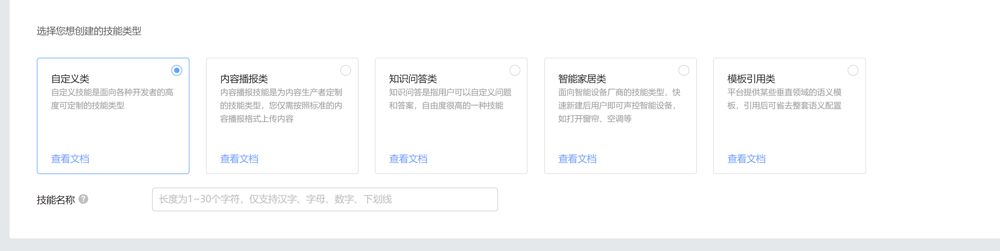

[TOC]
# 一. 接入前置条件

## 1.1 硬件要求
无

## 1.2  软件要求

无

## 1.3 平台要求

- 在云小微开放平台上创建一个自定义类技能，配置好服务地址，并发布技能。

    

- 应用勾选自定义技能，并发布应用。
- 自定义技能和应用，需在同一个项目下。
- 如技能勾选了必选的槽位，则只会在最后一轮才收到自定义技能的数据

# 二. 功能介绍

如果设备想要实现自己的语义定制逻辑，可以自己开发自定义类技能。

例如：

设备想要在qeury为“关闭屏幕”时，关闭设备屏幕。开发者可以在云小微开放平台创建自定义类技能。当用户query为“关闭屏幕”时，后台将会把语义、与自定义技能的数据通过`DeviceControl.Control`指令下发给设备，设备可以根据指令中的数据做自定义逻辑实现。

# 三. 功能流程

缺图

# 四. 接入方法

## 4.1 基本功能接入

### 实现事件上报
无

### 实现指令执行

1. [DeviceControl.Control](https://github.com/TencentDingdang/TVS-API/blob/master/protocal/DeviceControl.md#2-%E8%AE%BE%E5%A4%87%E6%8E%A7%E5%88%B6%E6%8C%87%E4%BB%A4%E8%87%AA%E5%AE%9A%E4%B9%89%E6%8A%80%E8%83%BD)指令：当语义命中自定义技能，并且没有进入多轮交互时，后台会下发这个指令。

# 五. 验证用例

- 按照开放平台的指导，开发并发布自定义技能。
- 输入自定义技能的语料，查看是否会返回`DeviceControl.Control`指令。如果返回，就是正常的。

# 六. 常见问题

