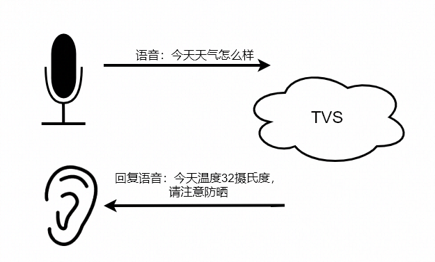

[TOC]
# 一. 接入前置条件

## 1.1 硬件要求
### 1.1.1 声学前端

语音识别对声学前端无特定要求，但是设备需要录音尽量清晰、少噪音。

## 1.2  软件要求

能力|是否必须|要求
-|-|-
TTS播放|必须|需要支持mp3音频流的播放。

## 1.3 平台要求

- 开通了有回复语的任意技能，如天气技能

# 二. 功能介绍

接收用户的语音输入，服务器端返回语音回复语，是TVS API最基本的能力。

功能示意：

# 三. 接入须知

语音输入的音频要求：

项|要求
-|-
格式|Speex/PCM/Opus
采样率|16k
位深度|16bit
字节序|小端模式

语音播报音频格式：MP3

# 三. 功能流程

一张图涉及用户、语音识别、语音朗读的交互流程。
# 四. 接入方法

## 实现下面的事件

1. SpeechRecognizer.Recognize事件：设备开始进行语音识别
2. SpeechSynthesizer.SpeechStarted事件：语音开始播报
3. SpeechSynthesizer.SpeechFinished事件：语音结束播报

## 实现下面的指令

1. SpeechRecognizer.StopCapture指令：服务器要求设备停止录音
2. SpeechSynthesizer.Speak指令：服务器要求设备进行语音播报

## 接入如下状态

# 五. 验证用例

# 常见问题

